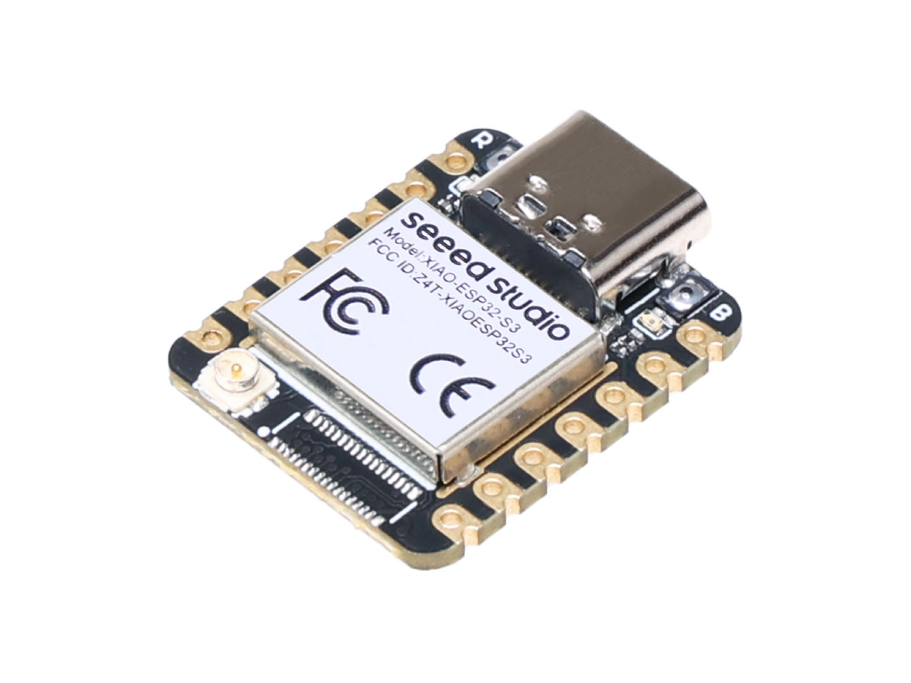
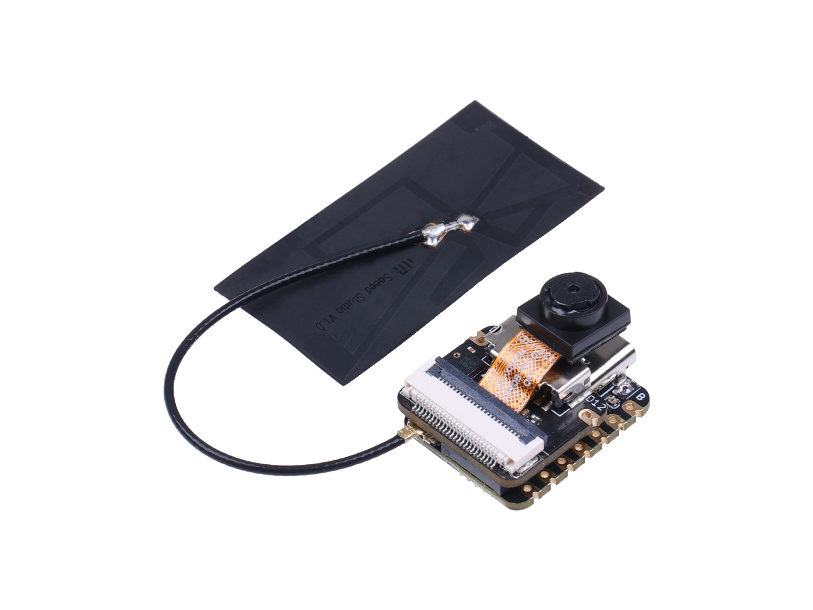

# 2Dave

# What is Dave?
According to the World Health Organization, 2.2 billion people around the world live with near or distant vision impairment. Over a quarter of this planet's population sees the world differently from how it should be, and this profoundly harms how people learn, walk, and work. Our team personally knows the impacts of vision impairment - three of our four members need to use contacts or glasses in daily life. Therefore, born out of our mutual interest in benefitting society, we developed DAVE - Digital Assistant for Vision Enhancement - to ease the burden of a vision-impaired lifestyle.

# Hardware
We are currently using Seeed Studio XIAO ESP32S3 for our processing unit. Addionaly we are using the camera and microphone modules for this board. 
Board:  
  
Camera & Microphone:  
  

More information about the XIAO ESP32S3 can be found: [Here](https://wiki.seeedstudio.com/xiao_esp32s3_getting_started/)

# Technology
Still in progress

# Team Members
* Shamar Samules
* Jordan Burt
* Arya Shahvar